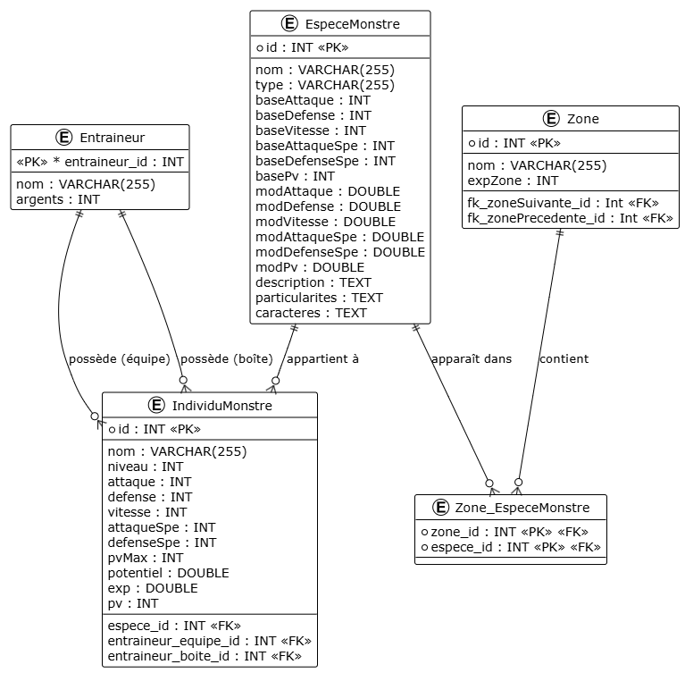

# Kotlin Monsters

## Description du jeu

**Kotlin Monsters** est un jeu inspiré des premières générations de **Pokémon**.
Vous incarnez un **dresseur de monstres** dont les principaux objectifs sont :

- Obtenir tous les **badges d’arène** ;
- **Capturer tous les monstres** du monde.

Le joueur peut explorer différentes zones (routes, cavernes, mers, etc.), capturer des monstres, combattre dans les arènes pour obtenir des badges, et acheter des objets pour progresser dans son aventure.

---

## Objectifs pédagogiques

Ce projet a été conçu dans un but **pédagogique** pour :

- Approfondir l’apprentissage de la **Programmation Orientée Objet (POO)** ;
- Apprendre à **travailler en mode projet** ;
- Mettre en place les **bonnes pratiques de développement** (commentaires, noms explicites, architecture claire) ;
- Développer des compétences en **résolution de problèmes et débogage** ;
- Découvrir et appliquer des **tests unitaires et fonctionnels** ;
- Comprendre et manipuler le concept de **DAO** pour la **persistance des données** en base de données.

---

## Analyse fonctionnelle

### Utilisateur

Un seul type d’utilisateur est présent : **le joueur**.

### Fonctionnalités principales

#### Sprint 1

- Se déplacer dans différentes zones ;
- Rencontrer des monstres sauvages ;
- Combattre ou capturer des monstres ;
- Consulter et organiser son équipe de monstres ;
- Utiliser des objets pendant et hors combat.

---

### Objectif du Sprint 3

Ce troisième sprint introduit une **connexion entre Kotlin Monsters et une base de données MySQL/MariaDB**.

Jusqu’à présent, les données (entraîneurs, monstres, espèces, etc.) étaient créées manuellement dans le code (`Main.kt`).  
L’objectif est désormais de :

- Centraliser et **stocker les données** dans une base de données ;
- **Automatiser les opérations CRUD** (Create, Read, Update, Delete) via des objets Kotlin ;
- Utiliser des **DAO (Data Access Objects)** pour simplifier les interactions entre le code et la base.

## Intégration de la base de données

> « En fin de sprint, le projet Kotlin Monsters sera capable de charger automatiquement les entraîneurs, espèces et monstres depuis la base de données sans avoir à les recréer dans le code. »

Mon projet charge également les **individusMonstre**, et les associe directement à leur entraîneur, que ce soit dans **équipeMonstre** ou **boiteMonstre**. Et il charge aussi les **zones**.

> À noter : Mis à part le joueur (enregistré en tant qu’**entraîneur**), il n’existe pas encore de système de **sauvegarde**.  
> Cependant, les éléments implémentés permettent d’imaginer une future extension du jeu où il serait possible d’enregistrer et de charger des parties.

---

## 🗃️ Structure de la base de données


### Tables créées

- Table entraineurs

| id  | nom   | argents |
| :-- | :---- | :------ |
| 1   | Alice | 1000    |
| 2   | Bob   | 1200    |
| 3   | Clara | 900     |
| 4   | Guap  | 100     |

- Table especesmonstre

| id  | nom        | type   | baseAttaque | baseDefense | baseVitesse | baseAttaqueSpe | baseDefenseSpe | basePv | modAttaque | modDefense | modVitesse | modAttaqueSpe | modDefenseSpe | modPv | description                                                                                                           | particularites                                             | caracteres                      |
| :-- | :--------- | :----- | :---------- | :---------- | :---------- | :------------- | :------------- | :----- | :--------- | :--------- | :--------- | :------------ | :------------ | :---- | :-------------------------------------------------------------------------------------------------------------------- | :--------------------------------------------------------- | :------------------------------ |
| 1   | springleaf | Graine | 9           | 11          | 10          | 12             | 14             | 60     | 6.5        | 9          | 8          | 7             | 10            | 14    | Un petit monstre espiègle au corps rond comme une graine. Il aime se cacher dans l’herbe haute et se dorer au soleil. | Sa feuille sur la tête s’incline pour indiquer son humeur. | Curieux, amical, un peu timide. |

> Je mets pas toutes les especes puisque ca prend trop de place.

- Table individumonstre

| id  | nom              | niveau | attaque | defense | vitesse | attaqueSpe | defenseSpe | pvMax | potentiel | exp | pv  | espece_id | entraineur_equipe_id | entraineur_boite_id |
| :-- | :--------------- | :----- | :------ | :------ | :------ | :--------- | :--------- | :---- | :-------- | :-- | :-- | :-------- | :------------------- | :------------------ |
| 39  | Springleaf_Alice | 5      | 9       | 11      | 10      | 12         | 14         | 60    | 1         | 0   | 60  | 1         | 1                    | null                |
| 40  | Aquamy_Bob       | 7      | 10      | 11      | 9       | 14         | 14         | 55    | 1         | 0   | 55  | 7         | 2                    | null                |
| 41  | Bugsyface_Bob    | 6      | 10      | 13      | 8       | 7          | 13         | 45    | 1         | 0   | 45  | 10        | 2                    | null                |
| 42  | Galum_Clara      | 8      | 12      | 15      | 6       | 8          | 12         | 55    | 1         | 0   | 55  | 13        | 3                    | null                |
| 43  | Flamkip_Clara    | 5      | 12      | 8       | 13      | 16         | 7          | 50    | 1         | 0   | 50  | 4         | 3                    | null                |

- Table zones

| id  | nom              | expZone | fk_zoneSuivante_id | fk_zonePrecedente_id |
| :-- | :--------------- | :------ | :----------------- | :------------------- |
| 1   | Foret Sombre     | 10      | 2                  | null                 |
| 2   | Caverne Obscure  | 20      | 3                  | 1                    |
| 3   | Montagne Ardente | 40      | null               | 2                    |

- Table zones_especesmonstre

| zone_id | espece_id |
| :------ | :-------- |
| 1       | 1         |
| 1       | 4         |
| 1       | 5         |
| 2       | 7         |
| 3       | 8         |
| 3       | 10        |

### DAO implémentés

- `EntraineurDAO`
- `EspeceMonstreDAO`
- `IndividuMonstreDAO`
- `ZoneDAO`

---

## Perspectives d’évolution

Pour les versions futures du projet, plusieurs améliorations peuvent être envisagées :

- Distinguer les **NPC** (personnages non-joueurs) des **vrais joueurs** ;
- Enregistrer la **zone actuelle du joueur** lors de la sauvegarde pour permettre de **reprendre la partie** sans tout recommencer ;
- Étendre les interactions entre zones, objets et quêtes ;

---

# Fichier Main

Cette partie explique en détail le code Kotlin qui initialise la connexion à la base de données, charge les données du jeu, et démarre une nouvelle partie avec les classes DAO et le système d'entraîneurs.

---

## Objectif du script

Ce code sert de point d'entrée au jeu. Il permet de :

1. Initialiser la connexion à la base de données (`BDD`).
2. Charger les données essentielles (zones, espèces, monstres, entraîneurs).
3. Créer un joueur et lancer une nouvelle partie (`Partie`).
4. Gérer les sauvegardes en base via les DAO.

---

## Connexion à la base de données

```kotlin
val db = BDD()
```

Cette ligne crée un objet `BDD`, responsable de :

- la connexion à la base de données,
- la préparation et exécution des requêtes SQL,
- et la fermeture propre des connexions.

---

## Initialisation des DAO

```kotlin
val entraineurDAO = EntraineurDAO(db)
val especeMonstreDAO = EspeceMonstreDAO(db)
val individuMonstreDAO = IndividuMonstreDAO(db)
val zoneDAO = ZoneDAO(db, especeMonstreDAO)
```

Chaque DAO (Data Access Object) correspond à une table de la base :

| DAO                  | Table SQL         | Rôle principal                             |
| -------------------- | ----------------- | ------------------------------------------ |
| `EntraineurDAO`      | `Entraineurs`     | Gère les entraîneurs et leurs équipes      |
| `EspeceMonstreDAO`   | `EspecesMonstre`  | Gère les espèces de monstres               |
| `IndividuMonstreDAO` | `IndividuMonstre` | Gère les monstres individuels              |
| `ZoneDAO`            | `zones`           | Gère les zones du monde et leurs relations |

**Note :** `ZoneDAO` dépend de `EspeceMonstreDAO` pour récupérer les espèces présentes dans une zone.

---

## Chargement des données depuis la base

```kotlin
val listeEntraineur = entraineurDAO.findAll()
val listeEspeces = especeMonstreDAO.findAll()
val listeIndividus = individuMonstreDAO.findAll()
val listeZones = zoneDAO.findAll()
```

Ces lignes chargent en mémoire toutes les entités nécessaires au jeu. Cela permet au système d’avoir immédiatement accès à :

- Tous les entraîneurs existants (Alice,Bob,Clara),
- Toutes les espèces de monstres,
- Tous les monstres individuels,
- Et toutes les zones du monde.

---

## Création des personnages

```kotlin
var joueur = Entraineur(1, "Sacha", 100)
var rival = Entraineur(2, "Regis", 200)
```

Deux personnages sont initialisés :

- `Sacha` (le joueur principal)
- `Regis` (le rival)

Ils ont chacun un **ID unique**, un **nom** et une **somme d’argent**.

---

## Création d’objets

```kotlin
var objet1 = MonsterKube(1, "cube", "description", 11.0)
```

Création d’un objet `MonsterKube`, équivalent d’une Pokéball.  
Le joueur aura cet objet dans son sac avant de commencer la partie.

---

## Fonction `nouvellePartie()`

```kotlin
fun nouvellePartie(): Partie {
    println("Bienvenue dans le monde magique des Pokémon!")
    println("Rentrez votre nom : ")
    val nomJoueur = readln()
    joueur.nom = nomJoueur

    val PartieJoueur = Partie(1, joueur, listeZones[0])
    joueur.id = 0
    entraineurDAO.save(joueur)
    return PartieJoueur
}
```

### Étapes de la fonction :

1. Accueille le joueur et lui demande son nom.
2. Crée un objet `Partie` avec :
   - un identifiant,
   - le joueur personnalisé,
   - la première zone du jeu.
3. Réinitialise l’ID du joueur à `0` pour forcer une **insertion** (et non une mise à jour) dans la base de données.
4. Sauvegarde le joueur avec `entraineurDAO.save()`.

---

## Démarrage du jeu

```kotlin
joueur.sacAItems.add(objet1)
val partie = nouvellePartie()
partie.choixStarter()
db.close()
partie.jouer()
```

### Étapes :

1. Ajout d’un objet dans le sac du joueur.
2. Création d’une nouvelle partie avec `nouvellePartie()`.
3. Le joueur choisit son **starter** (`choixStarter()`).
4. Fermeture de la connexion à la base (`db.close()`).
5. Lancement de la boucle de jeu (`partie.jouer()`).

---

# Explication de la classe `Entraineur`

Ce partie explique la structure et le fonctionnement de la classe `Entraineur` dans le jeu.

---

## 1. Description générale

La classe `Entraineur` représente un joueur ou un personnage non-joueur capable de posséder et gérer des monstres. Elle constitue le point central pour toutes les interactions du joueur avec ses monstres et objets.

### Responsabilités principales :

- Gérer une équipe de monstres actifs.
- Stocker des monstres supplémentaires dans une boîte.
- Contenir des objets utilisables en combat ou pour la progression.
- Gérer l'argent du joueur.

---

## 2. Propriétés

| Propriété       | Type                           | Description                                                         |
| --------------- | ------------------------------ | ------------------------------------------------------------------- |
| `id`            | `Int`                          | Identifiant unique de l'entraîneur.                                 |
| `nom`           | `String`                       | Nom de l'entraîneur (ex: "Alice", "Red").                           |
| `argents`       | `Int`                          | Quantité d'argent possédée par l'entraîneur.                        |
| `equipeMonstre` | `MutableList<IndividuMonstre>` | Monstres actifs dans l'équipe de combat.                            |
| `boiteMonstre`  | `MutableList<IndividuMonstre>` | Monstres supplémentaires stockés dans la boîte.                     |
| `sacAItems`     | `MutableList<Item>`            | Objets disponibles pour l'entraîneur (potions, MonsterKubes, etc.). |

---

## 3. Méthodes

### 3.1 `toString()`

Fournit une représentation textuelle complète de l'entraîneur, utile pour le débogage.
Inclut le nom, l'argent, l'équipe active, la boîte et le sac d'items.

```kotlin
override fun toString(): String
```

### 3.2 `afficheDetail()`

Affiche les informations essentielles de l'entraîneur pour l'utilisateur :

- Nom du dresseur.
- Quantité d'argent disponible.

```kotlin
fun afficheDetail() {
    println("Dresseur : $nom")
    println("Argents : $argents")
}
```

> Différence avec `toString()` :
>
> - `toString()` est destiné au débogage et montre toutes les informations techniques. (Meme si je m'en sers souvent pour l'ui..)
> - `afficheDetail()` est destiné à l'interface utilisateur, plus concis et lisible.

---

# Explication de la classe `EspeceMonstre`

La classe `EspeceMonstre` sert de modèle pour créer des monstres individuels dans le jeu.

---

## 1. Description générale

- **But** : Représenter une espèce de monstre.
- **Fonction** : Fournit les **statistiques de base**, les **modificateurs de croissance**, le **type élémentaire**, et une **représentation ASCII**.
- **Différence avec `IndividuMonstre`** :
  - Les valeurs de l'espèce sont **communes à tous les individus**.
  - Ne contient pas de statistiques propres à un individu.

---

## 2. Propriétés principales

| Propriété              | Description                                                          |
| ---------------------- | -------------------------------------------------------------------- |
| `id`                   | Identifiant unique pour référencer l'espèce dans une base de données |
| `nom`                  | Nom de l'espèce (ex : "Dracofeu")                                    |
| `type`                 | Type élémentaire (ex : "Feu", "Eau")                                 |
| `baseAttaque`          | Attaque physique initiale d'un individu                              |
| `baseDefense`          | Défense physique initiale                                            |
| `baseVitesse`          | Vitesse initiale                                                     |
| `baseAttaqueSpe`       | Attaque spéciale initiale                                            |
| `baseDefenseSpe`       | Défense spéciale initiale                                            |
| `basePv`               | Points de vie de base                                                |
| `modAttaque` à `modPv` | Multiplicateurs de croissance pour les stats lors des level-ups      |
| `description`          | Description textuelle pour l'utilisateur                             |
| `particularites`       | Aptitudes ou particularités de l'espèce                              |
| `caracteres`           | Art ASCII ou symbole représentant le monstre                         |

---

## 3. Méthodes

### 3.1 `afficheArt`

```kotlin
fun afficheArt(deFace: Boolean=true): String
```

- **But** : Afficher la représentation artistique ASCII du monstre.
- **Fonctionnement** :
  - Les fichiers ASCII sont stockés dans `src/main/resources/art/<nom_de_l_espece_lowercase>/front.txt` ou `back.txt`.
  - `deFace=true` affiche la vue de face, sinon la vue de dos.
  - Remplace certains caractères pour la sécurité :
    - `/` devient `∕`
    - Les codes ANSI `` sont conservés pour la couleur.
- **Retour** : Chaîne de caractères avec l’art ASCII et les codes couleur.

### 3.2 `toString`

```kotlin
override fun toString(): String
```

- **But** : Fournir une représentation textuelle simplifiée de l'espèce.
- Affiche uniquement `id`, `nom`, `type` et `basePv`.

---

## 4. Points importants

- La classe `EspeceMonstre` est **immutable pour la plupart des stats de base**, ce qui garantit que tous les individus d’une espèce commencent avec les mêmes bases.
- Permet de séparer **modèle (espèce)** et **instance (individu)** pour une meilleure organisation du code.
- Supporte la visualisation ASCII du monstre pour un rendu graphique simple dans la console.

---

# Explication de la classe `Zone`

La classe `Zone` représente une zone géographique dans le monde du jeu et gère les rencontres avec des monstres sauvages.

---

## 1. Description générale

- **But** : Représenter une zone dans le monde et organiser les rencontres de monstres.
- **Fonctionnalités** :
  - Définir les **espèces de monstres** pouvant apparaître.
  - Définir le **niveau d'expérience moyen** des monstres locaux.
  - Gérer les **zones adjacentes** pour la progression et le retour du joueur.

---

## 2. Propriétés principales

| Propriété         | Description                                                   |
| ----------------- | ------------------------------------------------------------- |
| `id`              | Identifiant unique de la zone                                 |
| `nom`             | Nom de la zone lisible par le joueur (ex : "Forêt de Roissy") |
| `expZone`         | Niveau d'expérience moyen des monstres sauvages               |
| `especesMonstres` | Liste des espèces de monstres pouvant apparaître dans la zone |
| `zoneSuivante`    | Référence vers la zone suivante                               |
| `zonePrecedente`  | Référence vers la zone précédente                             |

---

## 3. Méthodes principales

### 3.1 `genereMonstre`

```kotlin
fun genereMonstre() : IndividuMonstre
```

- **But** : Générer un monstre sauvage correspondant à la zone.
- **Processus** :

1. Sélection aléatoire d'une espèce parmi `especesMonstres`.
2. Calcul d'une expérience initiale basée sur `expZone` avec une variance aléatoire de ±20.
3. Instanciation d'un `IndividuMonstre` représentant le monstre sauvage.

- **Retour** : Un monstre sauvage prêt à combattre.

---

### 3.2 `rencontreMonstre`

```kotlin
fun rencontreMonstre(joueur: Entraineur)
```

- **But** : Déclencher une rencontre entre le joueur et un monstre sauvage.
- **Fonctionnement** :

1. Génère un monstre sauvage via `genereMonstre()`.
2. Sélectionne le premier monstre vivant du joueur.
3. Instancie un `CombatMonstre` et lance le combat.

- **Remarques** :
  - Un joueur doit avoir au moins un monstre vivant.
  - La méthode automatise le choix du monstre du joueur pour le combat.

---

### 3.3 `toString`

```kotlin
override fun toString(): String
```

- **But** : Représentation textuelle complète de la zone.
- **Affichage** :
  - ID, nom et expérience de base
  - ID des zones adjacentes
  - Liste des noms des espèces présentes

---

## 4. Points importants

- Chaque zone peut avoir ses **monstres spécifiques** avec un niveau moyen d'expérience.
- Les rencontres sont **aléatoires** mais influencées par `expZone` et `especesMonstres`.
- Permet de structurer le monde en **étapes progressives** et gérer la difficulté.
- Sépare la **logique de rencontre** et la **structure du monde** de la logique du combat et des monstres.

---

# Explication de la classe `IndividuMonstre`

Ce code définit deux entités principales pour représenter des monstres dans un jeu, ainsi que leurs mécaniques de progression et de combat.

---

## 1. `IndividuMonstreEntity`

```kotlin
data class IndividuMonstreEntity(
    var id: Int = 0,
    var nom: String,
    var niveau: Int,
    var attaque: Int,
    var defense: Int,
    var vitesse: Int,
    var attaqueSpe: Int,
    var defenseSpe: Int,
    var pvMax: Int,
    var potentiel: Double,
    var exp: Double,
    var pv: Int,
    var especeId: Int?,
    var entraineurEquipeId: Int?,
    var entraineurBoiteId: Int?
)
```

### Description

- **But** : Représenter un monstre en base de données.
- **Caractéristiques** :
  - Stocke les statistiques et relations avec l’espèce et l’entraîneur.
  - Ne contient **aucune logique de combat ou progression**.
  - Permet la persistance dans une base de données.

### Propriétés clés

| Propriété                                                   | Description                     |
| ----------------------------------------------------------- | ------------------------------- |
| `id`                                                        | Identifiant unique du monstre   |
| `nom`                                                       | Nom du monstre (modifiable)     |
| `niveau`                                                    | Niveau actuel                   |
| `attaque`, `defense`, `vitesse`, `attaqueSpe`, `defenseSpe` | Statistiques du monstre         |
| `pvMax`                                                     | Points de vie maximum           |
| `pv`                                                        | Points de vie actuels           |
| `potentiel`                                                 | Facteur de croissance unique    |
| `exp`                                                       | Expérience cumulée              |
| `especeId`                                                  | Référence à l’espèce du monstre |
| `entraineurEquipeId`, `entraineurBoiteId`                   | Références à l’entraîneur       |

---

## 2. `IndividuMonstre`

```kotlin
class IndividuMonstre(
    var id : Int,
    var nom : String,
    var espece : EspeceMonstre,
    var entraineur: Entraineur?= null,
    expInit : Double
)
```

### Description

- **But** : Représenter un monstre **vivant dans le jeu**.
- **Différences avec l’Entity** :
  - Contient la logique de progression, de combat et de gestion des PV.
  - Peut recevoir de l’expérience et monter de niveau.
  - Génère les statistiques initiales avec une **variation aléatoire** pour créer des monstres uniques.

---

### 2.1 Statistiques et propriétés de base

- Les stats (`attaque`, `defense`, `vitesse`, `attaqueSpe`, `defenseSpe`, `pvMax`) sont générées à partir des valeurs de base de l’espèce + une variation aléatoire.
- `potentiel` est un facteur unique (0.5 à 2.0) qui influence la croissance des stats.

---

### 2.2 Expérience et progression

```kotlin
var exp : Double = 0.0
    set(value){
        field = value
        while(field >= palierExp(niveau)){
            levelUp()
        }
    }
```

- La **propriété `exp`** :
  - Déclenche automatiquement le **level-up** si l’expérience dépasse le palier.
  - La fonction `palierExp(niveau)` calcule l’expérience nécessaire pour passer au niveau supérieur.

```kotlin
fun palierExp(niveau : Int) : Double{
    return 100 * ((niveau - 1).toDouble().pow(2.0))
}
```

- Formule quadratique simple pour l’expérience requise.

```kotlin
fun levelUp() { ... }
```

- Augmente le **niveau** et fait croître les statistiques selon le `potentiel`.
- Les PV sont ajustés proportionnellement et restent dans les limites `[0, pvMax]`.

---

### 2.3 Gestion des PV

```kotlin
var pv : Int = pvMax
    set(nouveauPv){
        field = nouveauPv.coerceIn(0, pvMax)
    }
```

- Assure que les PV restent **entre 0 et le maximum**.

---

### 2.4 Combat

```kotlin
fun attaquer(cible: IndividuMonstre){
    var degatBrut = this.attaque
    var degatTotal = degatBrut - (this.defense/2)
    if (degatTotal < 1) degatTotal = 1
    cible.pv -= degatTotal
}
```

- Simule une attaque physique.
- La formule est simplifiée :
  ```
  dégâts = attaque - (défense / 2)
  minimum = 1
  ```
- Affiche le nombre de PV perdus par la cible.

---

### 2.5 Interaction utilisateur

- **Renommer le monstre** : Permet de changer son nom.
- **Afficher les détails** : Affiche stats, PV et art ASCII du monstre.

---

### 2.6 Points importants

- **Aléatoire et potentiel** rendent chaque monstre unique même s’il appartient à la même espèce.
- **Level-up automatique** via le setter `exp`.
- **Gestion sûre des PV** pour éviter des valeurs invalides.
- **Séparation nette** entre `Entity` (persistance) et `IndividuMonstre` (logique du jeu).

---

# Explication des classes `Item` `MonsterKube` et `Badge` ainsi que l'interface `Utlisable`

Cette parite explique les différentes classes et interfaces définissant les objets du jeu, leur rôle, et leur utilisation.

---

## 1. Classe `Item`

```kotlin
open class Item(var id: Int, var nom: String, var description: String)
```

### Description

- Superclasse de tous les objets du jeu.
- Fournit une structure de base commune à tous les items.
- Attributs :
  - `id` : identifiant unique de l'objet.
  - `nom` : nom affiché dans le jeu.
  - `description` : texte explicatif de l'objet.

### Responsabilités

- Servir de modèle pour tous les objets dérivés.
- Permettre la gestion uniforme dans l'inventaire du joueur.

---

## 2. Interface `Utilisable`

```kotlin
interface Utilisable {
    fun utiliser(cible: IndividuMonstre, joueur: Entraineur): Boolean
}
```

### Description

- Définie le comportement d’un objet pouvant être utilisé sur un monstre.
- Méthode `utiliser` :
  - Paramètres : `cible` (monstre cible), `joueur` (entraîneur qui utilise l'objet).
  - Retourne `true` si l'action a réussi, `false` sinon.

---

## 3. Classe `MonsterKube`

```kotlin
class MonsterKube(...) : Item(...), Utilisable
```

### Description

- Objet de capture de monstres sauvages.
- Hérite de `Item` et implémente `Utilisable`.

### Fonctionnement

1. Vérifie si le monstre ciblé est déjà capturé.
2. Calcule la probabilité de capture en fonction des PV restants et du `chanceCapture`.
3. Tire un nombre aléatoire pour déterminer le succès.
4. En cas de succès :
   - Le joueur peut renommer le monstre.
   - Le monstre est ajouté à l'équipe ou à la boîte.
   - Le champ `entraineur` du monstre est mis à jour.
5. En cas d'échec : affichage d'un message d'échec.

---

## 4. Classe `Badge`

```kotlin
class Badge(id: Int, nom: String, description: String, var champion: Entraineur) : Item(id, nom, description)
```

### Description

- Représente un badge obtenu après avoir vaincu un champion d'arène.
- Hérite de `Item`.
- Attribut `champion` : référence vers l'entraîneur vaincu.

### Utilisation

- Sert à suivre la progression du joueur.
- Exemple :

```kotlin
val badgeFeu = Badge(1, "Badge Flamme", "Victoire contre le champion de l’arène de feu", championArèneFeu)
joueur.badges.add(badgeFeu)
```

---

# Explication de la classe `CombatMonstre`

La classe `CombatMonstre` gère les combats entre le monstre d'un joueur et un monstre sauvage. Elle encapsule toute la logique du combat, y compris les rounds, les actions du joueur et de l'adversaire, et la fin de combat.

---

## 1. Description générale

- **But** : Gérer un combat complet entre un monstre du joueur et un monstre sauvage.
- **Fonctionnalités** :
  - Gestion des rounds.
  - Détermination de l'ordre des actions selon la vitesse des monstres.
  - Gestion des actions du joueur et du monstre adverse.
  - Détection de la victoire, défaite ou capture.

---

## 2. Propriétés principales

| Propriété        | Description                                                            |
| ---------------- | ---------------------------------------------------------------------- |
| `joueur`         | L'entraîneur contrôlant le monstre joueur                              |
| `monstreJoueur`  | Le monstre actuellement actif du joueur                                |
| `monstreSauvage` | Le monstre adverse (sauvage ou d’un autre joueur)                      |
| `round`          | Compteur de rounds, commence à 1 et s’incrémente à chaque tour complet |

---

## 3. Méthodes principales

### 3.1 `gameOver`

```kotlin
fun gameOver(): Boolean
```

- **But** : Vérifier si le joueur a perdu le combat.
- **Condition** : Tous les monstres du joueur ont PV = 0.
- **Retour** : `true` si défaite, `false` sinon.

---

### 3.2 `joueurGagne`

```kotlin
fun joueurGagne(): Boolean
```

- **But** : Vérifier si le joueur a gagné le combat.
- **Conditions** :

1. Le monstre sauvage est K.O.
2. Le monstre sauvage a été capturé.

- **Action** : Attribue de l'expérience au monstre du joueur si victoire.

---

### 3.3 `actionAdversaire`

```kotlin
fun actionAdversaire()
```

- **But** : Exécuter l'action du monstre adverse.
- **Fonctionnement** : Attaque le monstre du joueur si PV > 0.

---

### 3.4 `actionJoueur`

```kotlin
fun actionJoueur(): Boolean
```

- **But** : Gérer le tour du joueur.
- **Options proposées** :

1. **Attaquer** : inflige des dégâts au monstre adverse.
2. **Prendre un item** : utiliser un objet du sac (potion, Pokéball, etc.).
3. **Changer de monstre** : remplacer le monstre actif par un autre de l’équipe.

- **Retour** : `true` si le combat continue, `false` si capture réussie ou défaite.

---

### 3.5 `afficheCombat`

```kotlin
fun afficheCombat()
```

- **But** : Afficher l’état actuel du combat.
- **Affiche** :
  - Monstre sauvage : niveau, PV, art ASCII face et dos.
  - Monstre du joueur : niveau, PV.

---

### 3.6 `jouer`

```kotlin
fun jouer()
```

- **But** : Exécuter un round complet.
- **Fonctionnement** :
  - Vérifie que les monstres sont encore en vie.
  - Détermine l'ordre selon la vitesse.
  - Gère les actions du joueur et de l’adversaire.

---

### 3.7 `lanceCombat`

```kotlin
fun lanceCombat()
```

- **But** : Lancer la boucle principale du combat.
- **Fonctionnement** :
  - Définit le premier monstre vivant comme monstre actif.
  - Continue le combat tant que le joueur n’a pas gagné ou perdu.
  - Réinitialise les PV des monstres si le joueur perd.
  - Affiche un message de fin de combat.

---

## 4. Points importants

- Le combat est **tour par tour** et la vitesse détermine l’ordre des actions.
- Permet **attaque, utilisation d’objets et changement de monstre**.
- Gère automatiquement les **gains d’expérience et capture**.
- Assure que le joueur ne peut pas agir avec un monstre K.O.
- Sépare la **logique du combat** de la logique du monde et des monstres, pour une meilleure modularité.

---

# Explication de la classe `Partie`

La classe `Partie`, qui représente une session de jeu active dans le monde du jeu de monstres. Elle gère la progression du joueur, les rencontres avec les monstres sauvages, l'équipe du joueur, et la navigation entre zones.

---

## 1. Description générale

- **But** : Représenter une session de jeu active.
- **Fonctionnalités principales** :
  - Choix du monstre de départ (starter).
  - Exploration et rencontres de monstres sauvages.
  - Gestion et réorganisation de l’équipe de monstres.
  - Navigation entre zones.

---

## 2. Propriétés principales

| Propriété | Description                          |
| --------- | ------------------------------------ |
| `id`      | Identifiant unique de la partie      |
| `joueur`  | Référence vers l’entraîneur actif    |
| `zone`    | Zone actuelle où se trouve le joueur |

---

## 3. Méthodes principales

### 3.1 `choixStarter`

```kotlin
fun choixStarter()
```

- **But** : Permet au joueur de choisir son monstre de départ (starter).
- **Processus** :

1. Chargement des trois espèces proposées (`Springleaf`, `Flamkip`, `Aquamy`) depuis la base de données via `especeMonstreDAO`.
2. Création de trois `IndividuMonstre` avec une expérience initiale fixe (1500).
3. Affichage des détails des trois monstres.
4. Choix de l’utilisateur avec renommage facultatif.
5. Ajout du starter choisi dans l'équipe du joueur.

---

### 3.2 `modifierOrdreEquipe`

```kotlin
fun modifierOrdreEquipe()
```

- **But** : Modifier manuellement l'ordre des monstres dans l’équipe du joueur (pratique pour quand on lance un combat).
- **Processus** :

1. Affiche l’équipe avec indices.
2. Demande à l’utilisateur de choisir l’indice du monstre à déplacer.
3. Demande l’indice de la nouvelle position.
4. Échange les positions via une variable temporaire.

- Ne fait rien si l’équipe contient moins de deux monstres.

---

### 3.3 `examineEquipe`

```kotlin
fun examineEquipe()
```

- **But** : Permet au joueur d’examiner son équipe.
- **Options** :
  - Entrer un numéro → affiche le détail du monstre correspondant.
  - `m` → modifie l’ordre de l’équipe.
  - `q` → quitte le menu.

---

### 3.4 `jouer`

```kotlin
fun jouer()
```

- **But** : Boucle principale du jeu avec interface textuelle pour la zone actuelle.
- **Options proposées** :

1. Rencontrer un monstre sauvage.
2. Examiner l’équipe de monstres.
3. Aller à la zone suivante.
4. Revenir à la zone précédente.

- **Fonctionnement** :
  - Appelle récursivement `jouer()` pour maintenir la session active.
  - Met à jour la zone courante si déplacement vers zone suivante/précédente.
  - Déclenche les rencontres de monstres via `zone.rencontreMonstre(joueur)`.

---

## 4. Points importants

- La classe `Partie` relie le joueur à une zone et gère **l’expérience de jeu**.
- Sépare la **logique de session** de la logique des monstres et du combat.
- Permet une **exploration progressive**, gestion d’équipe, et interactions simples via console.
- Utilise des DAO (`especeMonstreDAO`) pour charger les données persistantes des monstres.

---

# Explication de la classe `BDD`

La classe `BDD`, qui gère la connexion à une base de données MySQL via JDBC et l'exécution de requêtes SQL préparées.

---

## 1. Description générale

- **But** : Fournir une interface simple pour se connecter à une base de données et exécuter des requêtes SQL sécurisées.
- **Fonctionnalités principales** :
  - Connexion à une base de données MySQL.
  - Exécution de requêtes SQL préparées.
  - Gestion des exceptions liées à la connexion et aux requêtes.
  - Fermeture propre de la connexion.

---

## 2. Propriétés principales

| Propriété       | Description                                                                     |
| --------------- | ------------------------------------------------------------------------------- |
| `url`           | URL de la base de données (ex : `jdbc:mysql://localhost:3306/bd_monsters_home`) |
| `user`          | Nom d'utilisateur pour la connexion à la base                                   |
| `password`      | Mot de passe pour la connexion à la base                                        |
| `connectionBDD` | Objet `Connection` représentant la connexion à la base de données               |

---

## 3. Méthodes principales

### 3.1 `getConnection`

```kotlin
fun getConnection(): Connection?
```

- **But** : Crée et retourne une connexion à la base de données.
- **Fonctionnement** :

1. Charge le driver JDBC MySQL avec `Class.forName("com.mysql.cj.jdbc.Driver")`.
2. Établit la connexion via `DriverManager.getConnection(url, user, password)`.

- **Retour** : Objet `Connection` ou `null` en cas d'erreur.

---

### 3.2 `executePreparedStatement`

```kotlin
fun executePreparedStatement(preparedStatement: PreparedStatement): ResultSet?
```

- **But** : Exécute une requête SQL préparée et retourne le résultat.
- **Fonctionnement** :

1. Exécute la requête via `preparedStatement.executeQuery()`.
2. Capture et affiche les erreurs éventuelles.

- **Retour** : `ResultSet` contenant le résultat, ou `null` si erreur.

---

### 3.3 `close`

```kotlin
fun close()
```

- **But** : Fermer la connexion à la base de données proprement.
- **Fonctionnement** : Appelle `connectionBDD?.close()` pour libérer les ressources.

---

## 4. Initialisation (`init`)

- À la création de l'objet `BDD`, la connexion est automatiquement établie via `getConnection()`.
- Les exceptions lors de la connexion sont capturées et affichées.

---

## 5. Points importants

- La classe `BDD` facilite l'utilisation de JDBC pour Kotlin.
- Utilise des **requêtes préparées** pour plus de sécurité contre les injections SQL.
- Gère automatiquement la connexion et sa fermeture.
- Les TODO indiquent que l'URL, l'utilisateur et le mot de passe doivent être adaptés à votre serveur de base de données.

---

# DAO – `EntraineurDAO`

## Description générale

La classe `EntraineurDAO` est un **Data Access Object** qui gère toutes les interactions avec la table `Entraineurs` de la base de données. Elle encapsule la logique CRUD (Create, Read, Update, Delete) pour les objets `Entraineur`.  
Elle utilise une instance de `BDD` pour la connexion à la base et un DAO associé (`IndividuMonstreDAO`) pour récupérer les monstres liés à chaque entraîneur.

---

## Constructeur

```kotlin
class EntraineurDAO(
    val bdd: BDD = db,
    private val individuMonstreDAO: IndividuMonstreDAO = IndividuMonstreDAO(bdd)
)
```

- `bdd` : instance de connexion à la base.
- `individuMonstreDAO` : DAO pour accéder aux monstres liés aux entraîneurs.

---

## Méthodes principales

### 1. `findAll()`

Récupère tous les entraîneurs dans la base.

- Charge également les monstres de l’équipe et de la boîte.
- Retourne une liste mutable d’objets `Entraineur`.

### 2. `findById(id: Int)`

Cherche un entraîneur par son **ID**.

- Retourne un objet `Entraineur` complet avec son équipe et sa boîte.
- Retourne `null` si non trouvé.

### 3. `findByIdLight(id: Int)`

Version “light” de `findById` :

- Ne charge que les informations essentielles (id, nom, argent).
- Utile pour des listes ou des affichages rapides.

### 4. `findByNom(nomRechercher: String)`

Cherche un ou plusieurs entraîneurs par **nom exact**.

- Retourne une liste d’entraîneurs correspondant au nom.

### 5. `save(entraineur: Entraineur)`

Sauvegarde un entraîneur dans la base :

- Si `id = 0` → insertion, avec récupération automatique de l’ID généré.
- Sinon → mise à jour des informations existantes.
- Retourne l’entraîneur mis à jour ou `null` si échec.

### 6. `deleteById(id: Int)`

Supprime un entraîneur par son ID.

- Retourne `true` si la suppression réussit, `false` sinon.

### 7. `saveAll(entraineurs: Collection<Entraineur>)`

Sauvegarde une collection d’entraîneurs.

- Retourne une liste des entraîneurs sauvegardés avec succès.

---

## Méthodes privées

### `findMonstresByEntraineurId(idEntraineur: Int, isEquipe: Boolean)`

Récupère les monstres associés à un entraîneur.

- `isEquipe = true` → récupère l’équipe active.
- `isEquipe = false` → récupère la boîte.
- Retourne une liste mutable d’`IndividuMonstre`.

---

## Utilisation type

```kotlin
val dao = EntraineurDAO()
val tousLesEntraineurs = dao.findAll()
val joueur = dao.findById(1)
joueur?.argents = 500
dao.save(joueur!!)
dao.deleteById(3)
```

---

## Points clés

- Gestion complète des entraîneurs avec CRUD.
- Intégration automatique avec les monstres via `IndividuMonstreDAO`.
- Séparation claire entre la logique métier et l’accès à la base de données.

---

# DAO – `EspeceMonstreDAO`

## Package : `DAO`

Cette classe Kotlin implémente un **DAO (Data Access Object)** pour gérer la persistance des objets `EspeceMonstre` dans la base de données.

---

## Constructeur

```kotlin
class EspeceMonstreDAO(val bdd: BDD = db)
```

- `bdd` : Instance de connexion à la base (par défaut, l’objet global `db`).

---

## Méthodes principales

### 1. `findAll()`

Récupère **toutes** les espèces de monstres de la table `EspecesMonstre` et les convertit en objets `EspeceMonstre`.

**Retourne :** une `MutableList<EspeceMonstre>`.

---

### 2. `findById(id: Int)`

Recherche une espèce spécifique par son **identifiant unique**.

**Paramètre :** `id` → l’identifiant de l’espèce.

**Retourne :** `EspeceMonstre?` (ou `null` si non trouvée).

---

### 4. `findByNom(nomRechercher: String)`

Récupère toutes les espèces ayant un **nom exact** correspondant au paramètre.

**Paramètre :** `nomRechercher` → nom à chercher.

**Retourne :** `MutableList<EspeceMonstre>`.

---

### 5. `save(espece: EspeceMonstre)`

Sauvegarde une espèce dans la base :

- Si `espece.id == 0` → insertion.
- Sinon → mise à jour.

**Retourne :** `EspeceMonstre?` avec son ID mis à jour.

**Cas insertion :**

```sql
INSERT INTO EspecesMonstre (...)
VALUES (?, ?, ?, ...)
```

**Cas mise à jour :**

```sql
UPDATE EspecesMonstre SET ... WHERE id=?
```

---

### 6. `saveAll(especes: Collection<EspeceMonstre>)`

Sauvegarde plusieurs espèces à la fois en appelant `save()` pour chacune.

**Retourne :** Liste des espèces correctement enregistrées.

---

### 7. `deleteById(id: Int)`

Supprime une espèce selon son identifiant.

**Retourne :** `true` si la suppression a réussi, sinon `false`.

---

## Méthode utilitaire

### `mapResultSetToEspece(rs: ResultSet)`

Transforme une ligne SQL (`ResultSet`) en un objet `EspeceMonstre` complet.
Permet de centraliser la logique de conversion pour éviter les répétitions.

---

## Exemple d’utilisation

```kotlin
val dao = EspeceMonstreDAO()

// Lire toutes les espèces
val liste = dao.findAll()

// Rechercher par ID
val pikachu = dao.findById(1)

// Ajouter une nouvelle espèce
val espece = EspeceMonstre(
    id = 0,
    nom = "Pikachu",
    type = "Électrik",
    baseAttaque = 55,
    baseDefense = 40,
    baseVitesse = 90,
    baseAttaqueSpe = 50,
    baseDefenseSpe = 50,
    basePv = 35,
    modAttaque = 1.0,
    modDefense = 1.0,
    modVitesse = 1.0,
    modAttaqueSpe = 1.0,
    modDefenseSpe = 1.0,
    modPv = 1.0,
    description = "Un petit monstre électrique rapide et mignon.",
    particularites = "Peut générer de l’électricité.",
    caracteres = "Amical, curieux"
)

val sauvegarde = dao.save(espece)
```

---

## Points clés

La classe `EspeceMonstreDAO` est essentielle pour la couche **d’accès aux données** du jeu. Elle permet d’abstraire complètement les interactions SQL et de travailler uniquement avec des objets Kotlin typés, tout en garantissant la sécurité et la clarté du code.

# DAO - `IndividuMonstreDAO`

La classe **`IndividuMonstreDAO`** est responsable de la gestion des entités `IndividuMonstre` dans la base de données. Elle fournit une couche d’abstraction entre le modèle objet du jeu et les opérations SQL.

Elle gère la conversion entre :

- `IndividuMonstreEntity` : représentation base de données.
- `IndividuMonstre` : représentation métier utilisée dans le jeu.

---

## Objectif principal

Cette classe centralise toutes les opérations CRUD :

| Type d’opération | Méthode                                  | Description                                    |
| ---------------- | ---------------------------------------- | ---------------------------------------------- |
| Lecture          | `findAll()`, `findById()`, `findByNom()` | Permet de lire les individus depuis la base.   |
| Sauvegarde       | `save()`, `saveAll()`                    | Ajoute ou met à jour des individus.            |
| Suppression      | `deleteById()`                           | Supprime un individu via son identifiant.      |
| Conversion       | `mapResultSet()`, `toModel()`            | Transforme entre objets SQL et objets métiers. |

---

## Attributs principaux

- `bdd: BDD` → Gestionnaire de connexion à la base de données.
- `entraineurDAO` → Utilisé pour récupérer les entraîneurs liés.
- `especeMonstreDAO` → Utilisé pour récupérer les espèces associées.

---

## Lecture des données

### `findAll()`

Récupère tous les individus de la table `IndividuMonstre`.
Chaque ligne du `ResultSet` est convertie en un objet `IndividuMonstreEntity` via la méthode `mapResultSet()`.

### `findById(id: Int)`

Recherche un individu spécifique selon son identifiant unique.
Renvoie `null` si aucun individu n’est trouvé.

### `findByNom(nomRechercher: String)`

Permet de rechercher tous les individus correspondant à un nom donné.
Renvoie une liste de `IndividuMonstreEntity`.

---

## Sauvegarde (Create / Update)

### `save(individu: IndividuMonstreEntity)`

Permet de **sauvegarder ou mettre à jour** un individu dans la base.

- Si `individu.id == 0` → insertion (nouvel enregistrement).
- Sinon → mise à jour des champs existants.

Toutes les relations (espèce et entraîneur) sont gérées même si elles sont `null`.

### `saveAll(individus: Collection<IndividuMonstreEntity>)`

Sauvegarde une collection complète d’individus.
Appelle la méthode `save()` pour chacun d’entre eux et renvoie une liste des entités sauvegardées avec succès.

---

## Suppression

### `deleteById(id: Int)`

Supprime un individu en base via son identifiant.

- Utilise un `PreparedStatement` pour prévenir les injections SQL.
- Retourne `true` si la suppression a réussi, sinon `false`.

---

## Conversion et mapping

### `mapResultSet(rs: ResultSet)`

Méthode privée qui transforme une ligne SQL en `IndividuMonstreEntity`.

Cette méthode :

- Convertit chaque colonne SQL en propriété Kotlin.
- Gère les champs optionnels (`espece_id`, `entraineur_equipe_id`, `entraineur_boite_id`).

### `toModel(entity: IndividuMonstreEntity)`

Transforme une entité SQL (`IndividuMonstreEntity`) en objet métier (`IndividuMonstre`).

Étapes :

1. Récupère l’espèce via `especeMonstreDAO.findById()`.
2. Récupère l’entraîneur associé via `entraineurDAO.findByIdLight()`.
3. Crée un objet `IndividuMonstre` complet.
4. Réinjecte les valeurs exactes depuis la base pour garantir la cohérence.

---

## Points clés

- Les IDs générés lors des insertions sont récupérés via `RETURN_GENERATED_KEYS`.
- Les conversions sont soigneusement séparées entre base de données (Entity) et logique métier (Model).

---

## 📘 Exemple d’utilisation

```kotlin
val individuDAO = IndividuMonstreDAO(bdd)

// Lecture\ nval monstre = individuDAO.findById(3)

// Création d’un nouvel individu
val nouvelIndividu = IndividuMonstreEntity(
    id = 0,
    nom = "Flarion",
    niveau = 10,
    attaque = 50,
    defense = 30,
    vitesse = 45,
    attaqueSpe = 40,
    defenseSpe = 25,
    pvMax = 100,
    potentiel = 0.8,
    exp = 200.0,
    pv = 90,
    especeId = 1,
    entraineurEquipeId = null,
    entraineurBoiteId = 2
)

individuDAO.save(nouvelIndividu)
```

---

# DAO - `ZoneDAO`

## Description générale

La classe `ZoneDAO` est responsable de la gestion des interactions entre l’application et la base de données pour la table **`zones`**. Elle permet de :

- Lire, insérer, mettre à jour et supprimer des zones du jeu.
- Gérer les **relations** entre les zones et les **espèces de monstres**.
- Relier correctement les **zones suivantes** et **zones précédentes**.

Ce DAO centralise toutes les opérations SQL nécessaires pour manipuler les objets `Zone` dans le contexte du jeu.

---

## Constructeur

```kotlin
class ZoneDAO(
    val bdd: BDD = db,
    private val especeMonstreDAO: EspeceMonstreDAO = EspeceMonstreDAO(bdd)
)
```

### Paramètres :

- **bdd** : Objet de connexion à la base de données (par défaut la connexion globale `db`).
- **especeMonstreDAO** : Permet de charger les espèces de monstres associées à chaque zone.

---

## Méthodes principales

### 1. `findAll()` — Récupération de toutes les zones

Charge toutes les zones de la base, avec :

- leurs **informations de base** (`id`, `nom`, `expZone`),
- leurs **espèces de monstres** associées,
- les **liens entre zones** (`zoneSuivante` et `zonePrecedente`).

Renvoie une liste complète de zones prêtes à être utilisées dans le jeu.

---

### 2. `findById(id: Int)` — Recherche par identifiant

Filtre la zone correspondant à l’`id` donné à partir du résultat de `findAll()`.

**Retourne :**

- `Zone` si trouvée,
- `null` sinon.

---

### 3. `findEspecesByZoneId(zoneId: Int)` — Récupération des espèces d’une zone

Méthode privée qui charge toutes les **espèces de monstres** associées à une zone via la table de jointure `zones_especesmonstre`.

Utilise `EspeceMonstreDAO` pour transformer les résultats SQL en objets `EspeceMonstre`.

---

### 4. `save(zone: Zone)` — Insertion ou mise à jour

Sauvegarde une zone dans la base :

- Si `zone.id == 0`, crée une nouvelle entrée (INSERT) et récupère l’ID généré.
- Sinon, met à jour la zone existante (UPDATE).
- Met ensuite à jour la **table de jointure** `zones_especesmonstre` pour les relations entre zones et espèces.

**Retourne :** la zone sauvegardée avec ID mis à jour.

---

### 5. `saveAll(zones: Collection<Zone>)`

Sauvegarde en masse plusieurs zones en appelant `save()` sur chacune.

**Retourne :** une liste des zones sauvegardées avec succès.

---

### 6. `deleteById(id: Int)` — Suppression d’une zone

Supprime une zone ainsi que toutes ses relations :

1. Efface les associations dans `zones_especesmonstre`.
2. Supprime la ligne correspondante dans `zones`.

**Retourne :** `true` si la suppression a réussi, `false` sinon.

---

### 7. `saveZoneEspeces(zone: Zone)` — Gestion des relations

Méthode utilitaire qui gère les liens entre une zone et les espèces de monstres :

1. Supprime les anciennes relations de la zone.
2. Insère les nouvelles associations dans la table `zones_especesmonstre`.

---

## Fonctionnement global

1. Lors du chargement, toutes les zones sont lues depuis la base.
2. Chaque zone se voit associer :
   - Ses espèces de monstres (via `findEspecesByZoneId`).
   - Ses zones suivantes et précédentes (via des IDs liés).
3. Lors de la sauvegarde, les relations sont systématiquement mises à jour pour maintenir la cohérence de la base.

---

## Exemple d’utilisation

```kotlin
val zoneDAO = ZoneDAO()

// Récupération de toutes les zones
val zones = zoneDAO.findAll()
zones.forEach { println(it.nom) }

// Création et sauvegarde d’une nouvelle zone
val nouvelleZone = Zone(nom = "Forêt Mystique", expZone = 100)
zoneDAO.save(nouvelleZone)

// Suppression d’une zone
val supprimee = zoneDAO.deleteById(3)
println("Zone supprimée ? $supprimee")
```

---

## Points clés

- Séparation claire entre **accès base de données** et **logique métier**.
- Gestion complète des **relations entre zones et monstres**.
- Système de mise à jour cohérent évitant les erreurs d’intégrité référentielle.

---
